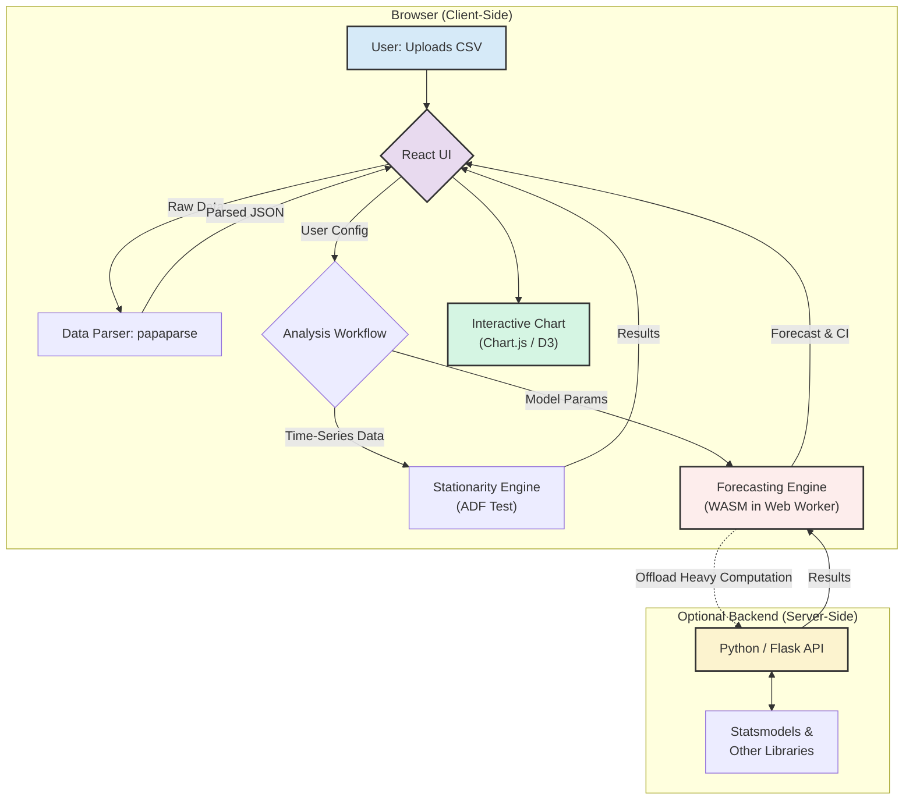

# Time-Twist Visualizer
[](https://github.com/ShovalBenjer/time-twist-visualizer/actions)
[](https://opensource.org/licenses/MIT)
[](https://www.typescriptlang.org/)
[](https://reactjs.org/)


Time-Twist Visualizer is an interactive, browser-based platform for end-to-end time-series analysis and forecasting. It empowers users to upload data, perform statistical tests, configure sophisticated predictive models, and visualize results through an intuitive, no-code interface.

### Executive Summary

In a world driven by data, the ability to forecast future trends is critical. However, the tools for time-series analysis are often complex, requiring extensive coding knowledge and setup. Time-Twist Visualizer bridges this gap by providing a powerful, accessible, and fully interactive solution that runs directly in the browser. By leveraging WebAssembly for client-side computation, the application delivers a secure, high-performance experience without backend dependencies for core tasks. This tool is designed for a wide range of users, from business analysts needing quick sales forecasts to data scientists prototyping models and engineers validating instrumentation data.

---

### 🔗 Live Demo & Core Features

**Experience the application live:** [**time-twist-visualizer.lovable.app**](https://time-twist-visualizer.lovable.app/)


#### Core Features

*   **Seamless Data Ingestion:** Upload CSV files with a simple drag-and-drop interface. The application automatically parses, validates, and previews time-series data for immediate analysis.

*   **Robust Stationarity Testing:** Integrated Augmented Dickey-Fuller (ADF) test to check for stationarity, a critical prerequisite for many forecasting models. Results are paired with rolling mean and variance visualizations to aid interpretation.

*   **Advanced Forecasting Suite:** A comprehensive library of configurable forecasting models, including:
    *   ARIMA (Autoregressive Integrated Moving Average)
    *   SARIMA (Seasonal ARIMA)
    *   SARIMAX (SARIMA with Exogenous Variables)
    *   AutoARIMA for automated hyperparameter tuning
    *   Exponential Smoothing
    *   Prophet

*   **Interactive Visualization Engine:** A dynamic charting module that renders historical data, model forecasts, and confidence intervals. Users can zoom, pan, and inspect data points through interactive tooltips.

*   **Client-Side Computation:** Performs computationally intensive tasks like model training and forecasting directly in the browser using a WebAssembly-powered engine. This enhances speed, ensures user data privacy, and reduces server-side costs.

*   **Guided User Workflow:** The interface is structured to guide users logically through the analysis process: Data Upload → Stationarity Test → Model Selection → Prediction.

---

### Potential Use Cases

This tool is designed to add value across various domains by making sophisticated forecasting accessible.

| Domain                 | Use Case Example                                                                  | Impact                                                                                    |
| ---------------------- | --------------------------------------------------------------------------------- | ----------------------------------------------------------------------------------------- |
| **Business & Retail**  | Forecast monthly sales for a specific product line based on historical data.      | Optimize inventory management, reduce holding costs, and prevent stockouts.               |
| **Finance & Economics**| Predict stock prices or economic indicators like GDP for the next quarter.        | Inform investment strategies and financial planning with data-driven insights.            |
| **Operations & Tech**  | Estimate future server load or API requests to plan for infrastructure scaling.   | Ensure system reliability, manage resource allocation efficiently, and control operational costs. |
| **Healthcare & Med-Tech**| Analyze patient admission rates or predict the spread of seasonal illnesses.      | Improve resource planning in hospitals and guide public health interventions.            |
| **Academic & Research**| Quickly test hypotheses and visualize time-series behavior without writing scripts. | Accelerate research cycles and provide an effective teaching tool for statistical concepts. |

---

### System Architecture

The application is built on a modern, decoupled architecture that prioritizes performance, security, and user experience by maximizing client-side computation.

#### Architectural Diagram

The diagram below illustrates the primary workflow. User data is processed entirely within the browser, from parsing to model training and visualization. The optional backend serves as an extension for heavier computational tasks or proprietary models.



#### Technology Stack

The stack is carefully selected to ensure a robust, scalable, and maintainable application.

| Category                | Technology / Library                                 | Purpose & Rationale                                                                                             |
| ----------------------- | ---------------------------------------------------- | --------------------------------------------------------------------------------------------------------------- |
| **Frontend Framework**  | **React 18** (with Vite) & **TypeScript**            | Provides a fast, modern development environment with strong typing for building a scalable and reliable UI.     |
| **UI Components & Styling** | **shadcn/ui**, **Tailwind CSS**                      | A utility-first approach for rapid, responsive UI development. `shadcn/ui` offers accessible component primitives. |
| **Data Visualization**  | **Chart.js** / **D3.js**                             | Delivers high-performance, interactive, and customizable charts essential for time-series analysis.             |
| **Client-Side Computation** | **WebAssembly (WASM)** via `arima-js` & **Web Workers** | Executes complex statistical models (ARIMA) in the browser without freezing the UI, ensuring data privacy and speed. |
| **Data Handling**         | **Papaparse**                                        | Efficiently parses CSV files directly in the browser, removing the need for server-side file processing.        |
| **Optional Backend API**  | **Python**, **Flask**, **Statsmodels**               | An optional, scalable backend for executing advanced statistical tests and models that are not yet available in WASM. |
| **State Management**      | **React Hooks** (`useState`, `useContext`, `useReducer`) | Manages application state in a clean, localized, and predictable manner without external dependencies.        |

---

### ML & Data Workflow

The application orchestrates a sophisticated pipeline that transforms raw user data into actionable forecasts. Each stage is designed to be both statistically sound and user-friendly.

#### The User Journey: From Raw Data to Actionable Insight

The workflow is intentionally linear to guide the user through the principles of time-series analysis methodically.

1.  **Ingestion & Validation:** The process begins with client-side CSV parsing. The system validates for a time-based column and a numeric value column, providing immediate feedback and a data preview. This step ensures data quality before any computation occurs.
2.  **Statistical Diagnosis:** Before modeling, the system performs a diagnostic check for stationarity using the Augmented Dickey-Fuller (ADF) test. This critical step informs the user whether the data's statistical properties (like mean and variance) are stable over time and suggests necessary transformations (e.g., differencing).
3.  **Intelligent Modeling:** Based on the diagnosis, the user can select from a suite of models. The UI provides sensible defaults and clear parameter descriptions, abstracting away complex statistical theory while retaining full control for expert users.
4.  **Prediction & Evaluation:** The chosen model is trained on the historical data, and a forecast is generated. The results are immediately plotted alongside historical data and confidence intervals, providing a clear visual assessment of the model's performance.

#### Stationarity Analysis Engine

A core principle of many forecasting models is that the time series must be stationary. This module automates the detection process.

*   **Implementation:** It uses the **Augmented Dickey-Fuller (ADF)** test, a statistical unit root test.
*   **Hypothesis:**
    *   *Null Hypothesis (H₀):* The series has a unit root (it is non-stationary).
    *   *Alternative Hypothesis (H₁):* The series is stationary.
*   **Interpretation:** The engine presents the key outputs in a clear table:
    *   **Test Statistic:** The core value calculated by the test.
    *   **p-value:** If this value is low (typically < 0.05), the null hypothesis is rejected, and the series is considered stationary.
    *   **Critical Values (1%, 5%, 10%):** Thresholds for the test statistic. If the statistic is less than a critical value, the series is stationary at that confidence level.
*   **Visual Aid:** To complement the statistical results, the application plots the series with its **rolling mean** and **rolling standard deviation**. A stationary series will exhibit a relatively constant mean and variance over time.

```typescript
// Conceptual Snippet: Invoking the ADF test via the backend
async function checkStationarity(series: number[]): Promise<ADFResult> {
  const response = await fetch('/api/adf-test', {
    method: 'POST',
    headers: { 'Content-Type': 'application/json' },
    body: JSON.stringify({ series }),
  });
  const result: ADFResult = await response.json();
  // result includes { test_statistic, p_value, critical_values }
  return result;
}
```

#### Hybrid Forecasting Engine (In-Browser WASM + Optional Backend)

To deliver a fast and private experience, Time-Twist Visualizer uses a hybrid computation model.

*   **Primary Engine (In-Browser via WebAssembly):**
    *   **Technology:** The core forecasting models like ARIMA and SARIMA are powered by `arima-js`, a library compiled to **WebAssembly (WASM)**.
    *   **Execution:** Model training and prediction run inside a **Web Worker**. This multithreaded approach prevents the main browser UI from freezing during heavy computation, ensuring a smooth user experience.
    *   **Benefits:**
        1.  **Data Privacy:** User data never leaves the browser.
        2.  **Zero Latency:** No network round-trip for computation.
        3.  **Scalability:** Reduces server load and operational costs.

    ```typescript
    // Conceptual Snippet: Running ARIMA in a Web Worker
    // worker.ts
    import ARIMA from 'arima-js';

    self.onmessage = (event) => {
      const { timeSeries, params } = event.data;
      const arima = new ARIMA(params);
      arima.train(timeSeries);
      const [prediction, errors] = arima.predict(30); // Forecast 30 steps ahead
      self.postMessage({ prediction, errors });
    };
    ```

*   **Secondary Engine (Optional Python Backend):**
    *   **Purpose:** For models not yet available in a performant JS/WASM library (e.g., complex SARIMAX with multiple exogenous variables, or Prophet) or for users who need to process massive datasets.
    *   **Technology:** A Python Flask server using the industry-standard `statsmodels` library.
    *   **Flexibility:** This architectural choice makes the platform highly extensible, allowing for the future integration of any Python-based forecasting model behind a simple API endpoint.

#### Interactive Visualization Layer

The final output is rendered using a highly configurable charting component built on top of Chart.js.

*   **Features:**
    *   **Multi-Series Plotting:** Overlays historical data, forecasted values, and confidence intervals in a single, coherent view.
    *   **Confidence Intervals:** Visualized as a shaded area around the forecast, providing an immediate sense of prediction uncertainty.
    *   **Dynamic Tooltips:** Hovering over any data point reveals its exact timestamp and value.
    *   **Zoom and Pan:** Allows users to inspect specific periods in detail.

---

### Performance Benchmarks

Performance is a key architectural pillar. The client-side WebAssembly engine is optimized for speed, providing results comparable to native Python execution for typical dataset sizes, without network latency.

The following benchmarks are illustrative and were performed on a standard consumer laptop (Apple M1, 8GB RAM) using the in-browser WASM engine.

| Model   | Dataset Size (Points) | Computation Time (Avg.) | Notes                                                |
| :------ | :-------------------- | :---------------------- | :--------------------------------------------------- |
| ARIMA   | 500                   | `~150 ms`               | Near-instantaneous, ideal for rapid iteration.       |
| ARIMA   | 2,000                 | `~600 ms`               | Remains highly responsive for moderately sized series. |
| SARIMA  | 1,000 (seasonal=12)   | `~850 ms`               | Seasonal components add computational complexity.    |
| AutoARIMA | 500                 | `~2.5 s`                | Slower due to iterative search for optimal parameters. |

**Key Takeaway:** The in-browser engine provides a highly interactive experience for datasets commonly found in business and operational analytics. For datasets exceeding 5,000-10,000 points or requiring complex model searches, the optional Python backend is recommended.

---

### Getting Started

Follow these instructions to set up and run the project locally for development or contribution.

#### Prerequisites

*   **Node.js** (v18.0 or higher recommended)
*   **npm** (v9.0 or higher) or an alternative package manager like `yarn` or `pnpm`.

#### Installation & Setup

1.  **Clone the repository:**
    ```bash
    git clone https://github.com/ShovalBenjer/time-twist-visualizer.git
    ```

2.  **Navigate to the project directory:**
    ```bash
    cd time-twist-visualizer
    ```

3.  **Install dependencies:**
    This command installs all the required packages defined in `package.json`.
    ```bash
    npm install
    ```

#### Running the Application

1.  **Start the development server:**
    This command starts the Vite development server with Hot Module Replacement (HMR) enabled for a seamless development experience.
    ```bash
    npm run dev
    ```

2.  **Open in your browser:**
    The application will be available at `http://localhost:5173`.

---

### Project Development History

This project was developed iteratively, with key features and architectural components delivered across a planned schedule. The timeline below highlights the major milestones from conception to completion.

| Quarter   | Milestone Achieved                                   | Status      | Details                                                                                                                                |
| :-------- | :--------------------------------------------------- | :---------- | :------------------------------------------------------------------------------------------------------------------------------------- |
| **Q1 2024** | **Core Architecture & Prototyping**                  | ✅ Completed | Laid the foundational architecture using React, Vite, and TypeScript. Implemented the core data upload and parsing functionality.         |
| **Q1 2024** | **Stationarity Analysis Module**                     | ✅ Completed | Integrated the Augmented Dickey-Fuller (ADF) test with rolling statistics visualization to provide essential diagnostic tools.           |
| **Q2 2024** | **In-Browser Forecasting Engine (WASM)**             | ✅ Completed | Implemented the primary forecasting engine using `arima-js` in a Web Worker, ensuring a high-performance, private, and responsive UI. |
| **Q2 2024** | **Interactive Visualization Layer**                  | ✅ Completed | Developed the dynamic charting component to render historical data, forecasts, and confidence intervals with interactive features.       |
| **Q3 2024** | **Expanded Model Suite & UI Polish**                 | ✅ Completed | Added support for additional models like SARIMA and AutoARIMA. Refined the user workflow and component library for a production-ready feel. |
| **Q3 2024** | **Deployment & Finalization**                        | ✅ Completed | Deployed the application to a live environment, conducted final testing, and completed comprehensive documentation.                     |

---

### Contributing

Contributions are welcome and appreciated! Whether you're fixing a bug, proposing a new feature, or improving documentation, your help makes this project better. Please follow these steps to contribute:

1.  **Fork the repository** on GitHub.
2.  **Create a new branch** for your feature or bug fix:
    ```bash
    git checkout -b feature/my-new-feature
    ```
3.  **Make your changes** and commit them with a clear, descriptive message.
4.  **Push your branch** to your forked repository:
    ```bash
    git push origin feature/my-new-feature
    ```
5.  **Open a Pull Request** against the `main` branch of the original repository. Please provide a detailed description of the changes you've made.

---

### License

This project is licensed under the **MIT License**. See the [LICENSE](LICENSE) file for full details. You are free to use, modify, and distribute this software for personal or commercial purposes.

---

### Acknowledgments

*   This project was inspired by the powerful statistical capabilities of tools like `statsmodels` in Python and the accessibility of platforms like Facebook's Prophet.
*   Built with the incredible open-source libraries and frameworks in the React and Node.js ecosystems.
*   UI components powered by `shadcn/ui`.
