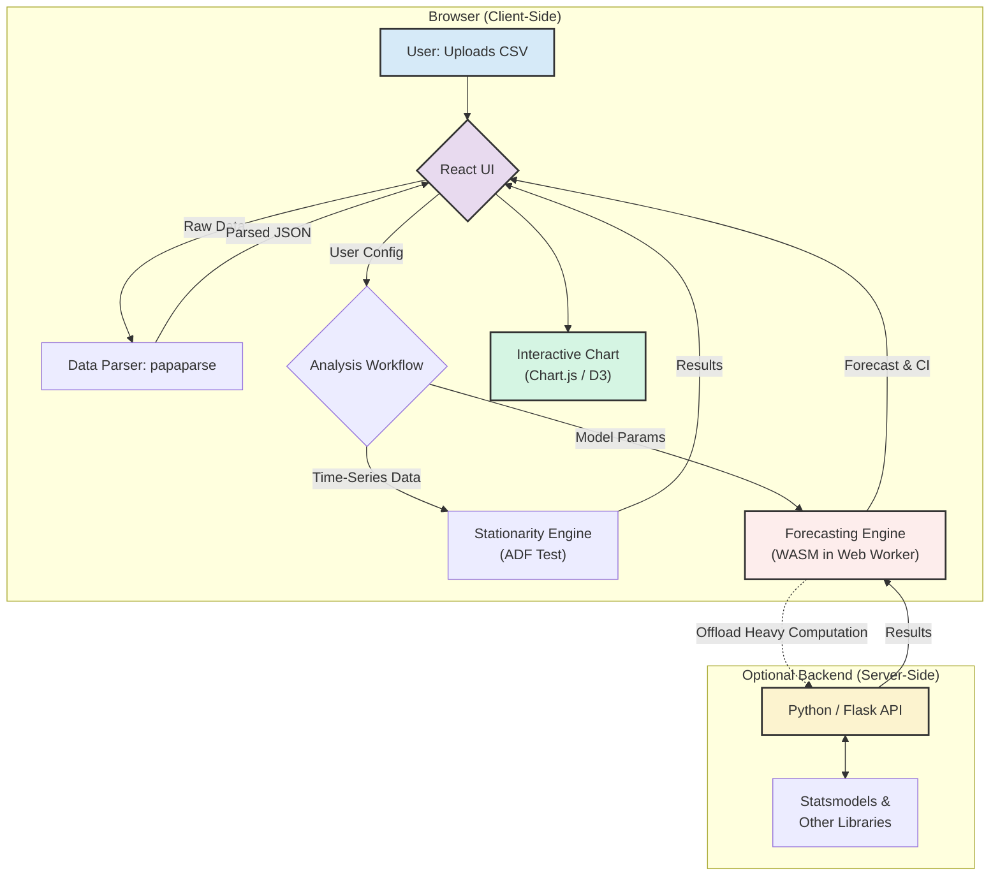

# Time-Twist Visualizer

[](https://opensource.org/licenses/MIT)
[](https://www.typescriptlang.org/)
[](https://reactjs.org/)

Browser-based time-series analysis and forecasting. Upload a CSV, run ADF stationarity tests, fit ARIMA/SARIMA/Prophet models, and get a forecast with confidence intervals -- no backend required for core tasks. Models run in a Web Worker via WebAssembly so the UI stays responsive.

**[Live demo: time-twist-visualizer.lovable.app](https://time-twist-visualizer.lovable.app/)**


---

## How It Works

**Data flow:** CSV upload (papaparse) -> ADF stationarity test -> model selection -> forecast -> interactive chart.

**Forecasting engine:** ARIMA, SARIMA, SARIMAX, AutoARIMA, Exponential Smoothing, and Prophet. Core models run client-side via `arima-js` compiled to WASM in a Web Worker. Complex models or large datasets fall back to an optional Python/Flask backend using `statsmodels`.

**Stationarity test:**
```typescript
// ADF test invocation via backend
async function checkStationarity(series: number[]): Promise<ADFResult> {
  const response = await fetch('/api/adf-test', {
    method: 'POST',
    headers: { 'Content-Type': 'application/json' },
    body: JSON.stringify({ series }),
  });
  return response.json(); // { test_statistic, p_value, critical_values }
}
```

**In-browser ARIMA:**
```typescript
// worker.ts
import ARIMA from 'arima-js';
self.onmessage = (event) => {
  const { timeSeries, params } = event.data;
  const arima = new ARIMA(params);
  arima.train(timeSeries);
  const [prediction, errors] = arima.predict(30);
  self.postMessage({ prediction, errors });
};
```

---

## Architecture



---

## Performance (WASM, Apple M1)

| Model | Dataset Size | Time |
|-------|-------------|------|
| ARIMA | 500 pts | ~150ms |
| ARIMA | 2,000 pts | ~600ms |
| SARIMA | 1,000 pts (seasonal=12) | ~850ms |
| AutoARIMA | 500 pts | ~2.5s |

For datasets >5,000 points or complex SARIMAX, use the optional Python backend.

---

## Stack

React 18 + Vite, TypeScript, shadcn/ui, Tailwind CSS, Chart.js/D3, WebAssembly (`arima-js`), Web Workers, Papaparse, optional Python/Flask/Statsmodels backend.

---

## Setup

Node.js v18+.

```bash
git clone https://github.com/ShovalBenjer/time-twist-visualizer.git
cd time-twist-visualizer
npm install
npm run dev
# Open http://localhost:5173
```

---

## Contributing

Fork, branch off `main`, commit with a clear message, open a PR.

---

## License

MIT. See [LICENSE](LICENSE).
